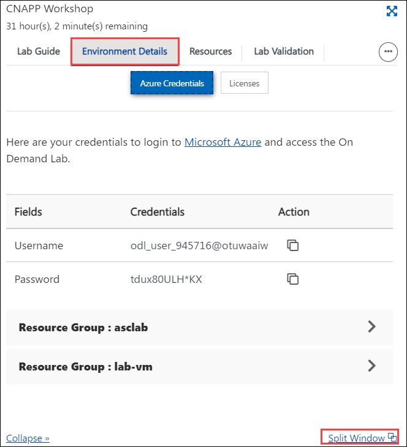
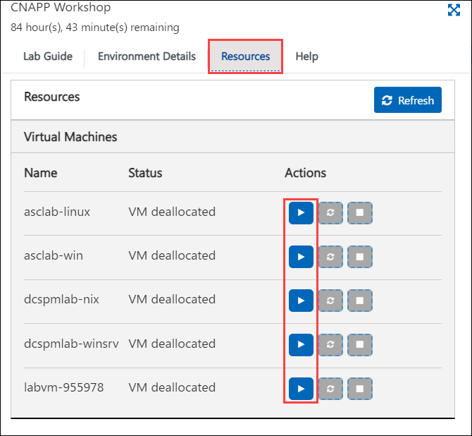
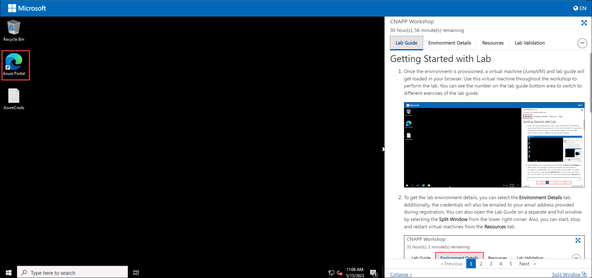
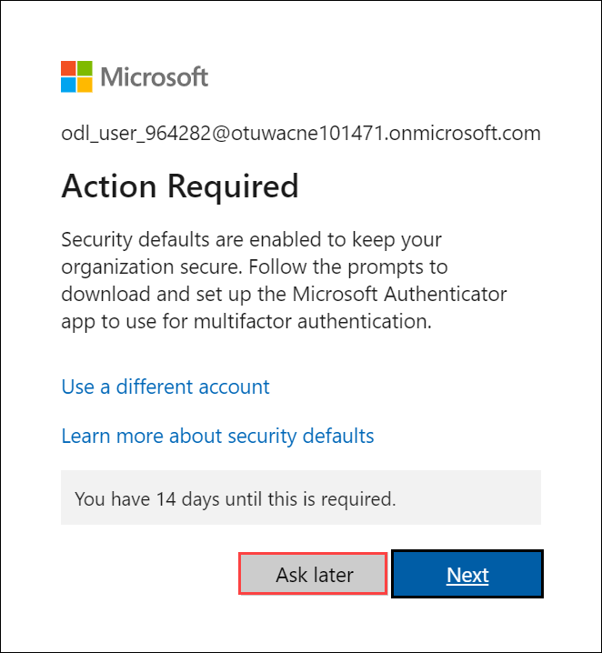
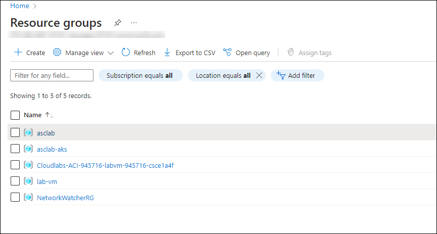

# Module 1: Getting Started with Lab

1. Once the environment is provisioned, a virtual machine (JumpVM) and lab guide will get loaded in your browser. Use this virtual machine throughout the workshop to perform the lab. You can see the number on the lab guide bottom area to switch to different exercises of the lab guide.
   

   

1. To get the lab environment details, you can select the **Environment Details** tab. Additionally, the credentials will also be emailed to your email address provided during registration. You can also open the Lab Guide on a separate and full window by selecting the **Split Window** from the lower right corner. Also, you can start, stop, and restart virtual machines from the **Resources** tab.

   
 
1. Verify all the Virtual Machines are running. If not, please click on **Start** action button in the **Resources** tab.

   

## Login to Azure Portal

1. In the JumpVM, click on the Azure portal shortcut of the Microsoft Edge browser from the desktop.

   
   
1. On the **Sign in to Microsoft Azure** tab you will see a login screen, enter the following email/username and then click on **Next**. 
   * Email/Username: **<inject key="AzureAdUserEmail" enableCopy="true"/>** 
   
     
     
1. Now enter the following password and click on **Sign in**.
   * Password: **<inject key="AzureAdUserPassword" enableCopy="true"/>**
   
     
     
1. If you see the pop-up **Stay Signed in?**, click **No**.

1. On **Action Required** pop-up, click on **Ask later**.

     

1. If you see the pop-up **You have free Azure Advisor recommendations!**, close the window to continue the lab.

1. If a **Welcome to Microsoft Azure** popup window appears, click **Maybe Later** to skip the tour.
   
1. Now you will see Azure Portal Dashboard, click on **Resource groups** from the Navigate panel to see the resource groups.

   
   
1. Confirm you have a resource groups present as shown in the below screenshot.

   
   
1. Now, click on Next from the lower right corner to move to the next page.
