# Module 2 - Defender for Containers

## Objectives
This exercise guides you on how to validate and use Defender for Containers.

### Exercise 1: Verify Docker Installation

 1. Search for PowerShell in Search bar and select **Windows PowerShell**.

   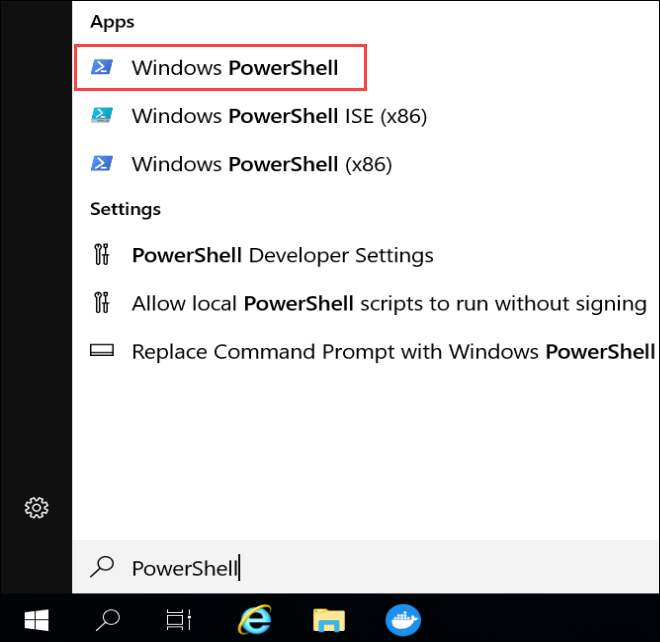

2. Verify your docker version by executing in PowerShell 

   ```
   docker version
   ```

   You may see an output like the one below:

   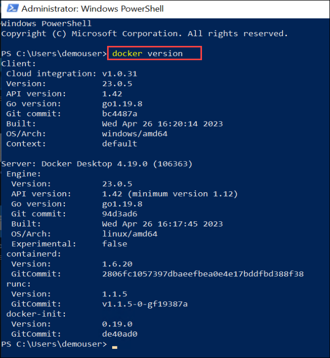


### Exercise 2: Download vulnerable image from Docker Hub into the Container Registry

Now you will use Docker to download a vulnerable image from it and push it into our existing Azure Container registry.

1. Navigate to the Azure Portal, search for **container** **(1)** in the search box and select **Container registries** **(2)**.

   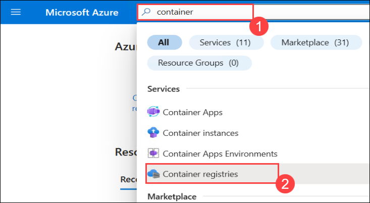

2. Open the Container Registry named **<inject key="Container registry" enableCopy="true"/>**.

   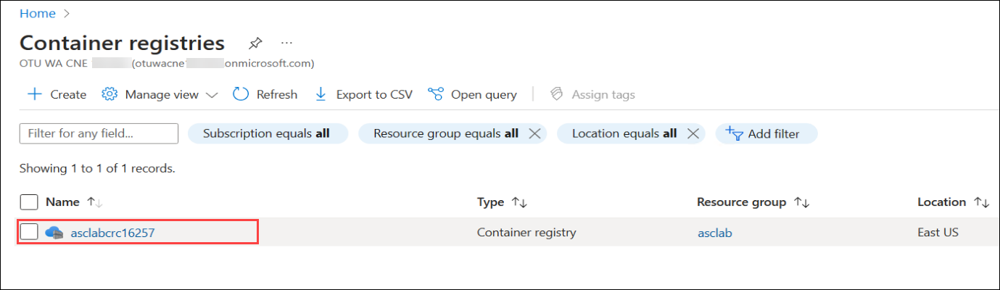

3. In the Overview of it, verify the Login server name only. 

   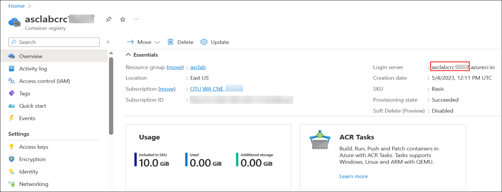

4.	Switch back to PowerShell, you will also need to login to your Azure subscription via **az login**. Enter the following **Email/Username** and **Password** in the browser and click on **Sign in**:

      * Email/Username: **<inject key="AzureAdUserEmail" enableCopy="true"/>** 

      * Password: **<inject key="AzureAdUserPassword" enableCopy="true"/>**

5. Make sure to update **NameOfServer** to **<inject key="Container registry" enableCopy="true"/>** and then run the below command.
   
   ```
   az acr login --name NameOfServer
   ```
 
   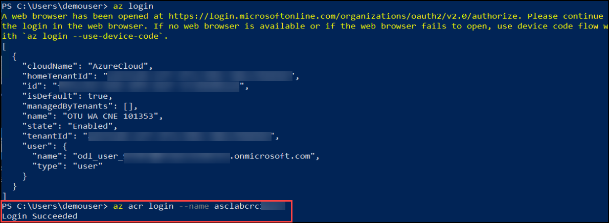

6. Download vulnerable image from docker hub, by running the command below in Powershell:

   ```
   docker pull vulnerables/web-dvwa
   ```

   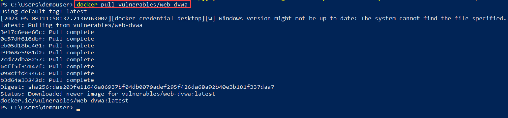

7. Check the image on your local repository by running the command below:

   ```
   docker images vulnerables/web-dvwa
   ```

   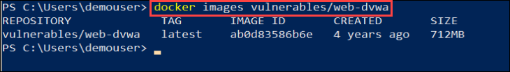

8. Create an alias of the image by runnig the following command and make sure to replace **NameOfServer** to **<inject key="Container registry" enableCopy="true"/>** and then run the below command:

   ```
   docker tag vulnerables/web-dvwa NameOfServer.azurecr.io/vulnerables/web-dvwa
   ```

9. Check again the image on your local repository by running the command and make sure to replace **NameOfServer** to **<inject key="Container registry" enableCopy="true"/>** and then run the below command:

   ```
   docker images NameOfServer.azurecr.io/vulnerables/web-dvwa
   ```

   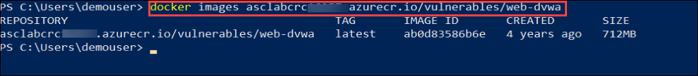


10. Run docker push to upload the new image to the azure repository and generate image scan (it can take some time), using the below command and make sure to replace **NameOfServer** to **<inject key="Container registry" enableCopy="true"/>** and then run the below command: :

    ```
    docker push NameOfServer.azurecr.io/vulnerables/web-dvwa
    ```

    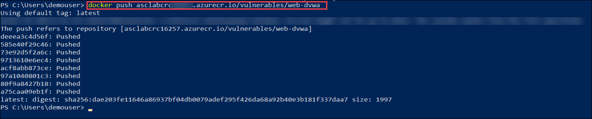

11. Then navigate back to the Azure portal and open the Container registry named **<inject key="Container registry" enableCopy="false"/>**.

12. Now select **Repositories** **(1)** under Services in the **<inject key="Container registry" enableCopy="false"/>** Container Registry resource. Notice the **vulnerable image** **(2)** is found in the ACR repository.

    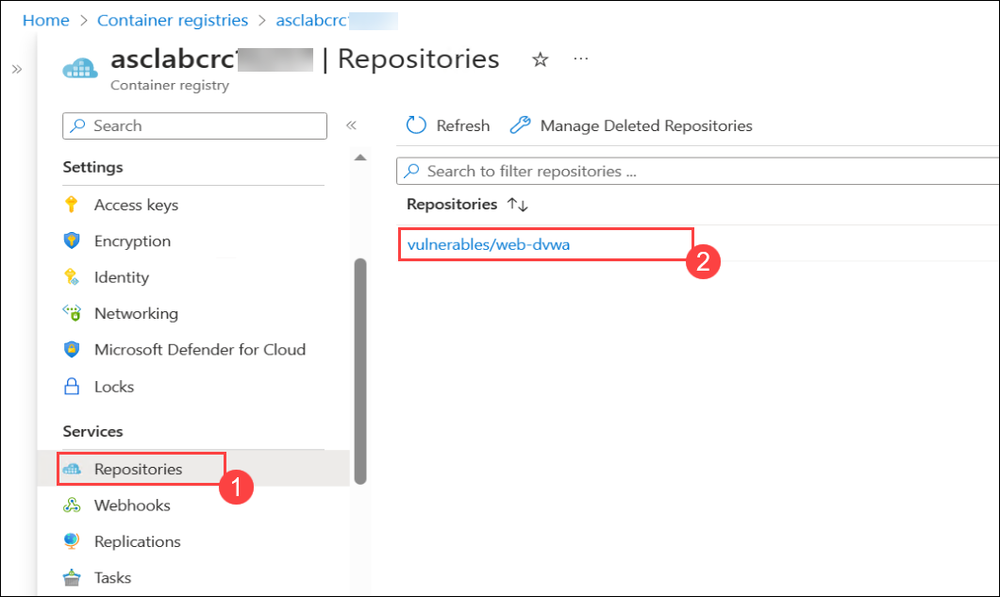

### Exercise 3: Investigate the recommendation for vulnerabilities in ACR

Once a vulnerable image has been pushed to the Azure Container Registry registry, then Microsoft Defender for Containers will start scanning the image for vulnerabilities, by using Qualys. You will now look into the recommendation in Microsoft Defender for Cloud for this. 
 
1. In the Azure Portal, searh for Microsoft Defender **(1)** in the search box and then select **Microsoft Defender for Cloud** **(2)**.

    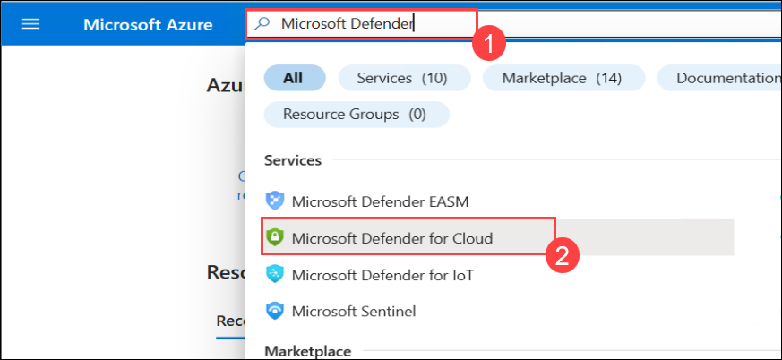
   
2. From the **Microsoft Defender for Cloud** pane, select **Recommendations** from left-menu under General.

    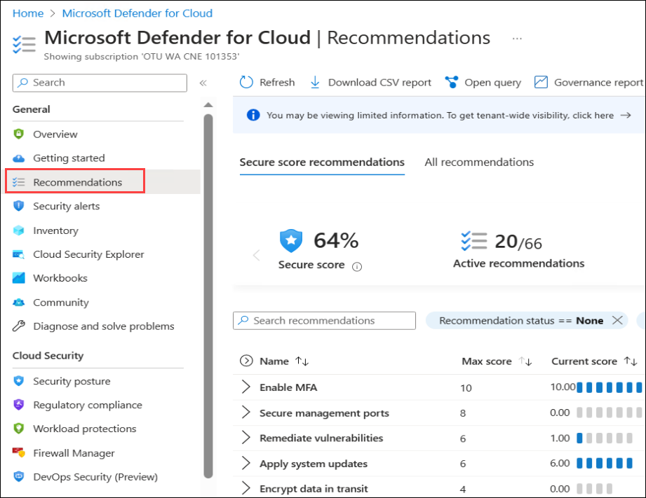
 
3. Now under Secure score recommendations pane, set the **Resource type** filter to have it equal to **Container registries** **(1)** and then expand the **Remediate vulnerabilities** **(2)**. Click on the recommendation **Container registry images should have vulnerability findings resolved** **(3)** to get more details about it.  
   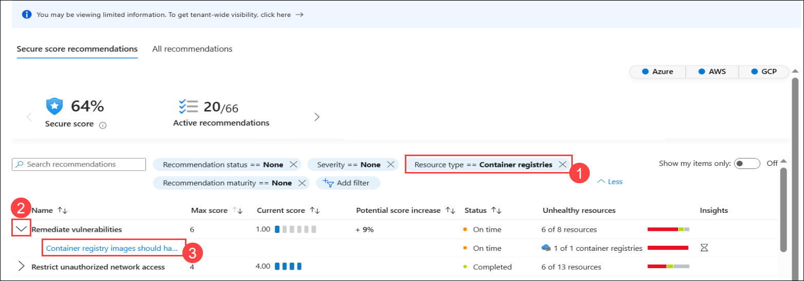

4. Look around at what's available in the recommendation. Take a note of the Remediation Steps.

   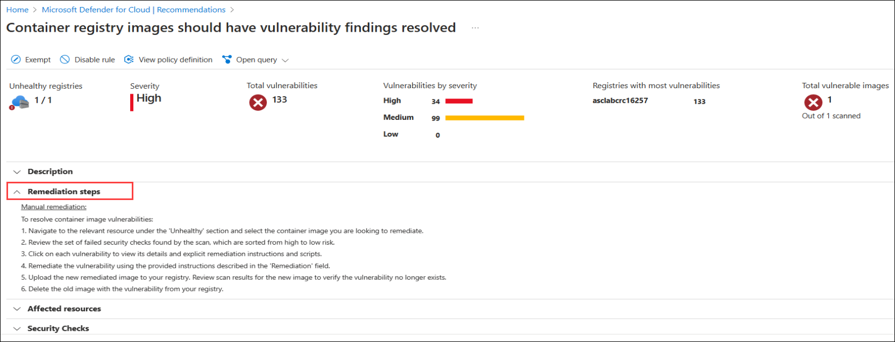
  
5. Select the vulnerability **Container registry images should have vulnerability findings resolved** to get more details about the patch available for it and how to remediate it.

   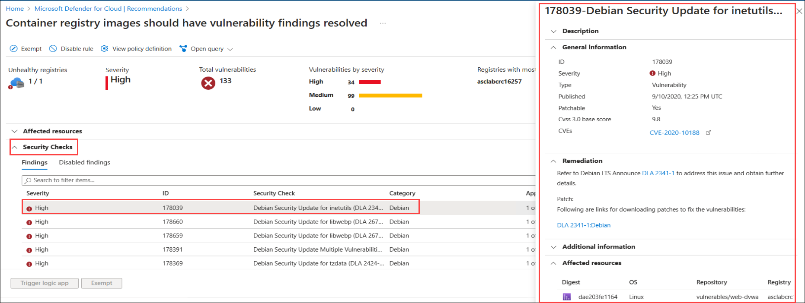
 
