# Module 4 – Integrating Defender for DevOps with GitHub Advanced Security

## Objectives
In this exercise, you will learn how to configure GitHub Connector in Defender for DevOps.

### Exercise 1: Connecting your GitHub organization

1.	In [Azure Portal](http://portal.azure.com/), search for **Microsoft Defender for Cloud (1)** and then click on it from the search results **(2)**. 

    

2.	In the left navigation pane, click **Environment settings (1)**, click the **Add environment (2)** button and click **GitHub (preview) (3)**. 

    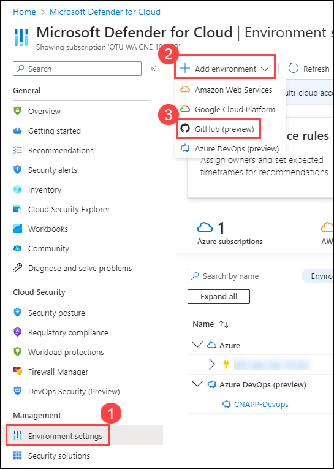

3. In **Create GitHub connection** page, enter the **Name** for the connector as `CNAPP-git` **(1)**, select your **Subscription (2)**, select **asclab (3)** **Resource Group** and select any **Region (4)**.	Click **Next:select plans > (5)** button to continue.

    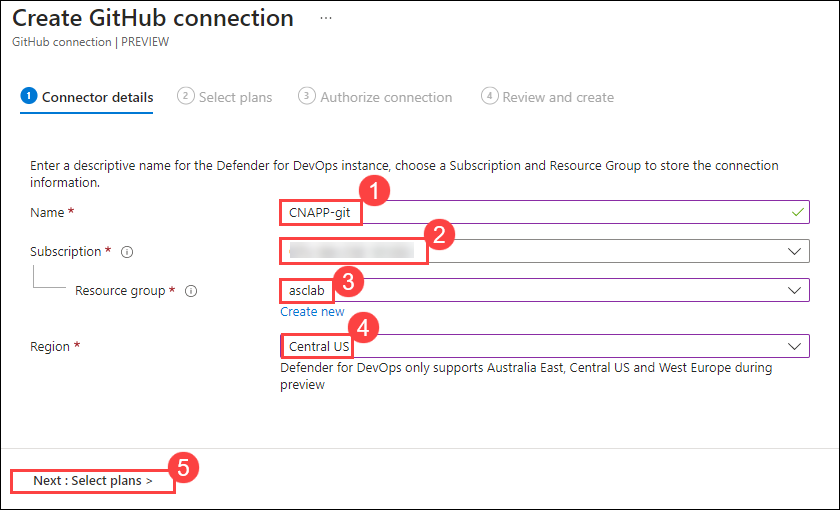

4. In the next page leave the default selection with **DevOps** selected and click **Next: Authorize connection >** button to continue. 

    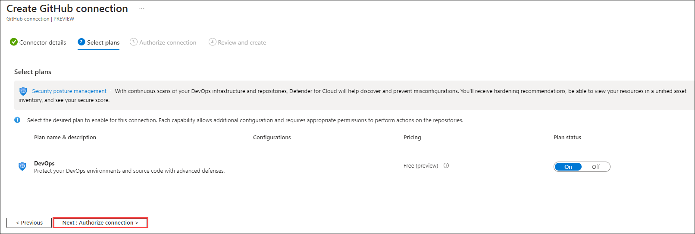

5.	Click **Authorize** button. If you get an authorization pop-up click **Authorize Microsoft SecurityDevOps**.

    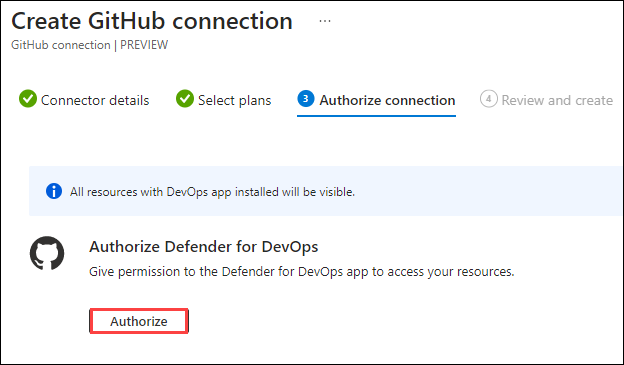

    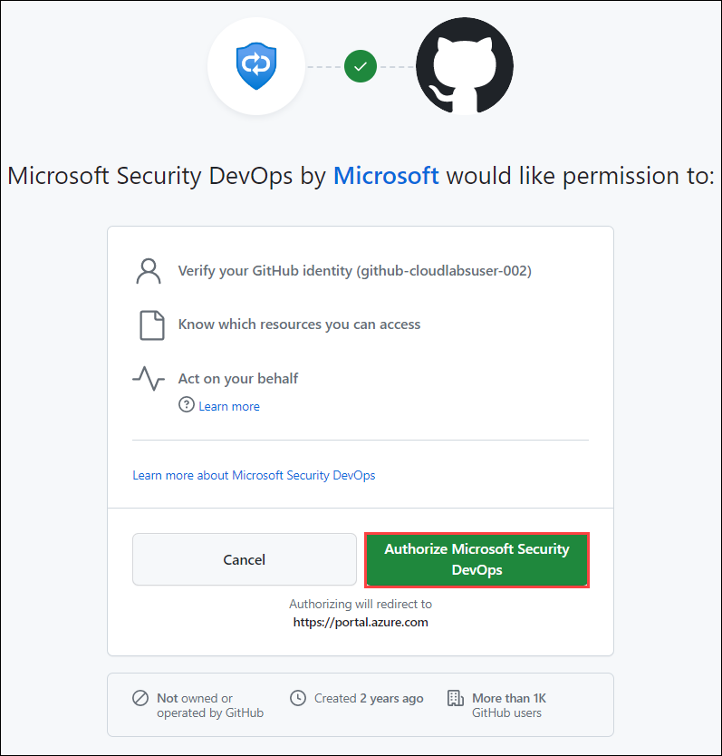

6.	Now Click **Install** button under **Install Defender for DevOps app**. If this is the first time you’re authorizing your DevOps connection, you’ll receive a pop-up screen, that will ask you confirmation of which repository you'd like to install the app. Select your **Github repository**. 

    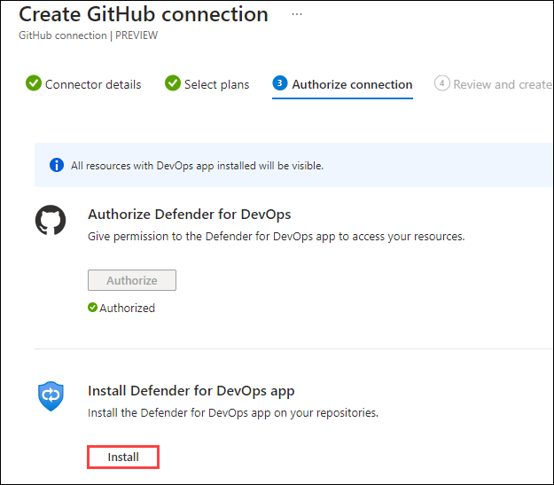

    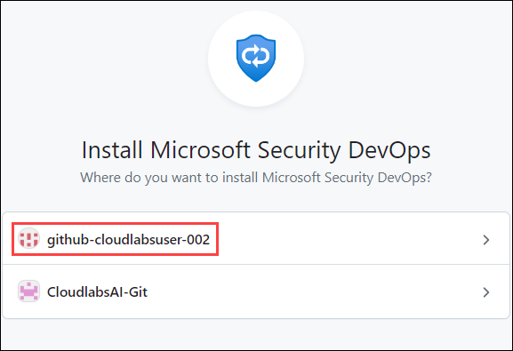

7. Choose **All repositories (1)** and click on **Install (2)**

    

8. Back in the **Azure portal**, you’ll notice that the extension is installed, click on **Review and Create** button to continue.  

    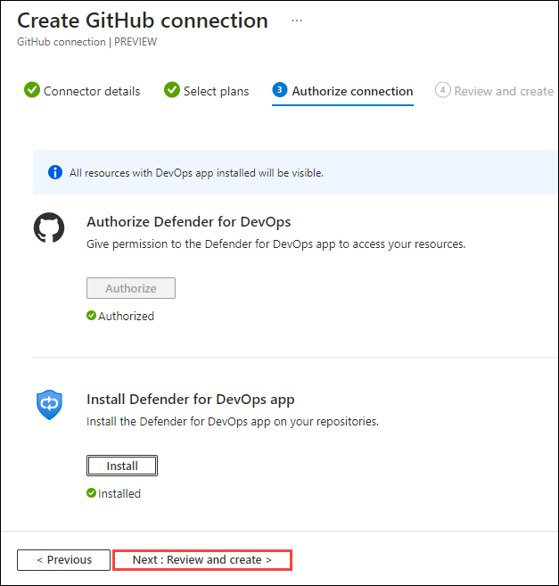

9. Click **Create**.

    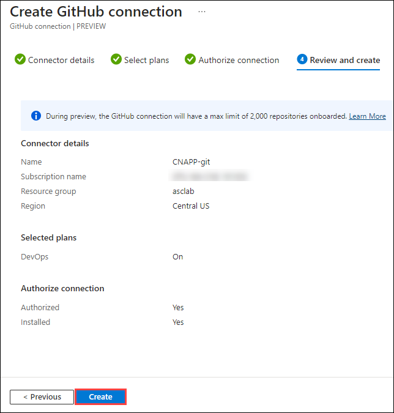

11. Navigating to the **Environment Settings** under **Microsoft Defender for Cloud**, you’ll notice the GitHub Connection was successfully created. 

    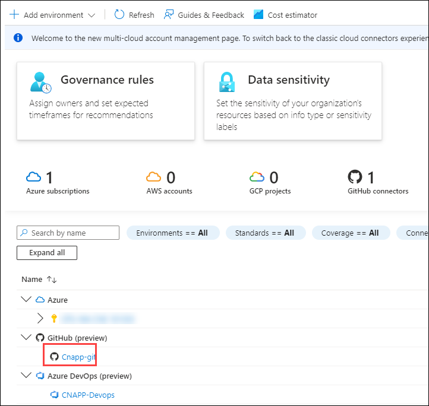

### Exercise 2: Configure the Microsoft Security DevOps GitHub action

1.	Login to the [GitHub](https://github.com/), by fetching the details from **Licenses (1)** and copy the **Github credentials (2)** .

    

2.	Select **CNAPP** repository.

3.	Select **Actions (1)** and click on **set up a workflow yourself (2)**.  

    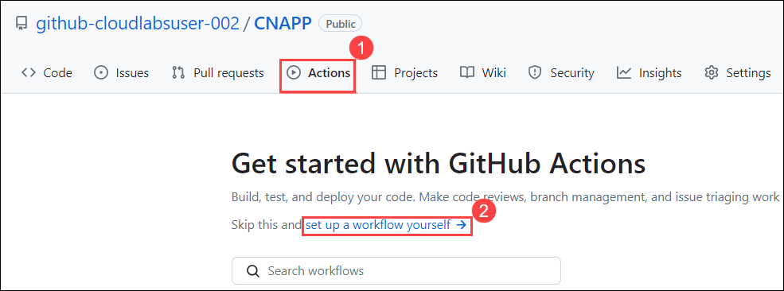

4. Enter the name for your workflow file as **msdevopssec.yml (1)**. Then copy and paste the following sample action workflow into the **Edit new file (2)** tab. 

    ~~~~~~
    name: MSDO IaC Scan

    on:
      # Triggers the workflow on push or pull request events but only for the main branch
      push:
        branches: [ main ]

      pull_request:
        branches: [ main ]

      workflow_dispatch:

    jobs:
      security:
        runs-on: windows-latest
        continue-on-error: false
        strategy:
          fail-fast: true

        steps:
        - uses: actions/checkout@v3

        - uses: actions/setup-dotnet@v3
          with:
            dotnet-version: |
              5.0.x
              6.0.x

        - name: Run Microsoft Security DevOps
          uses: microsoft/security-devops-action@preview
          continue-on-error: false
          id: msdo
          with:
            categories: 'IaC'

        - name: Upload alerts to Security tab
          uses: github/codeql-action/upload-sarif@v2
          with:
            sarif_file: ${{ steps.msdo.outputs.sarifFile }}
    ~~~~~~~

   
    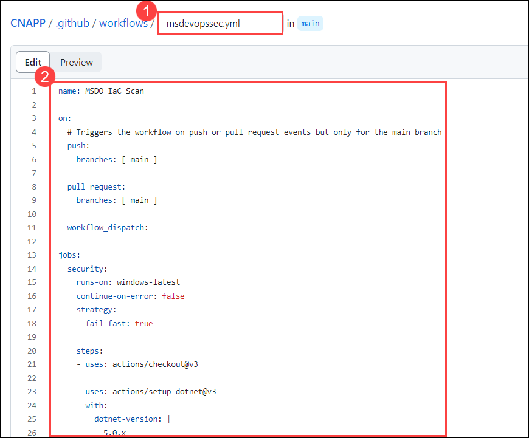

5.	Click on **Commit Changes** and click **Commit Changes** again on 

    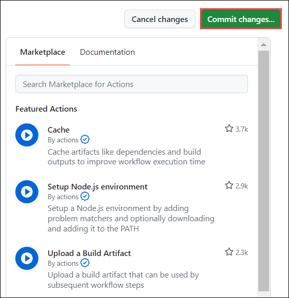

    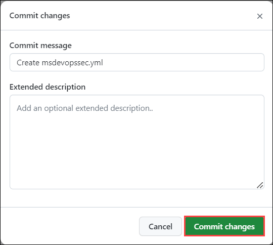

6. The process can take up to one minute to complete. A workflow gets created in your repositories github folder with the above copied yml file. 

    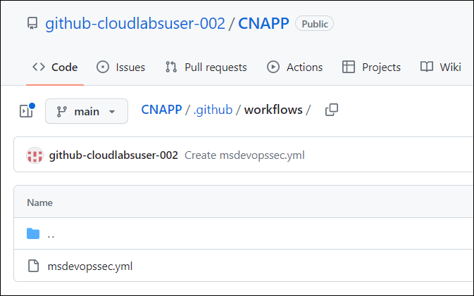

7.	Select **Actions** and wait for it to complete running. 

    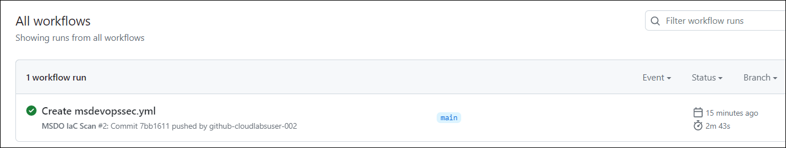

    >**Note**: If the work flows fails with error **Resource not accessible by integration**. Navigate to repository **Settings (1)**, under **Actions (2)** select **General (3)** and set the **Workflow Permissions** to **Read and write permissions (4)** then click **Save (5)**. Now **Re-run** the workflow.

      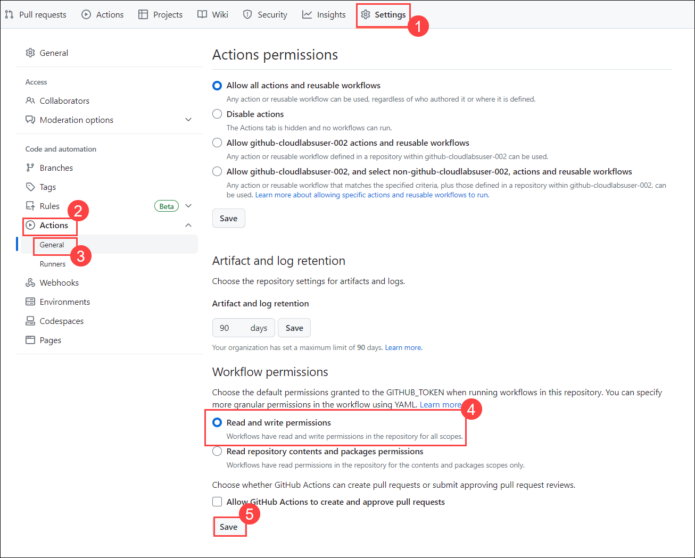

8.	Once this job completes running, navigate to the **Security (1)** tab and click on **Code scanning (2)**. 

      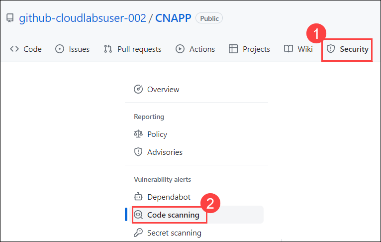

9.	If you see No code scanning alerts here, In the filter of Code scanning tab, choose is:open tool: Notice the available tools Defender for DevOps uses.

10.	Code scanning findings will be filtered by specific MSDO tools in GitHub. These code scanning results are also pulled into Defender for Cloud recommendations.

      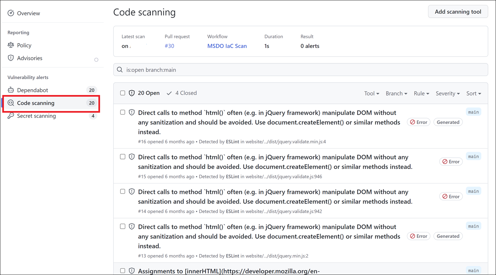

